# PROJECT_MAP.md — Vizzo Platform Task DAG (Part 1 of 3)

> Production-grade task decomposition. Parts 2 and 3 will append Phase 2 (Dashboard), Phase 3 (Storefront), Phase 4 (Infrastructure), and Orphans.

---

## Phase 0: Monorepo Scaffolding

### P0-01 — Workspace Root
- **status**: Done
- **dependencies**: —
- **repo_path**: `package.json`, `tsconfig.base.json`
- **execution_prompt**: Create npm workspace root. `package.json` must define `"workspaces": ["packages/*"]` with `"private": true`. Create `tsconfig.base.json` with `compilerOptions`: `strict: true`, `target: "ES2022"`, `module: "ESNext"`, `moduleResolution: "bundler"`, `jsx: "react-jsx"`, `esModuleInterop: true`, `skipLibCheck: true`, `forceConsistentCasingInFileNames: true`, `resolveJsonModule: true`, `isolatedModules: true`, `noEmit: true`. Add `"exclude": ["node_modules", "dist"]`. Create `.nvmrc` with `22`. Create `.gitignore` covering `node_modules/`, `dist/`, `.env`, `.env.local`, `.wrangler/`.

### P0-02 — Shared Package
- **status**: Done
- **dependencies**: P0-01
- **repo_path**: `packages/shared/**`
- **execution_prompt**: Create `packages/shared/package.json` with `"name": "@vizzo/shared"`, `"type": "module"`, `"main": "src/index.ts"`. Create `tsconfig.json` extending `../../tsconfig.base.json` with `include: ["src"]`.

**File: `packages/shared/src/types/index.ts`** — Export all interfaces:
  - `CartItem { product_id: string; quantity: number; variant?: string }` — the ONLY shape allowed in localStorage
  - `Product { id: string; store_id: string; name: string; base_price: number; discount_price: number | null; is_discounted: boolean; discount_expires_at: string | null; is_available: boolean; is_archived: boolean; category: 'phones' | 'laptops' | 'accessories'; images: string[]; sort_order: number; brand: string | null; storage_capacity: string | null; ram: string | null; color: string | null; condition: 'new' | 'used' | null; processor: string | null; gpu_type: 'internal' | 'external' | 'none' | null; gpu_name: string | null; storage_type: 'hdd' | 'ssd' | null; notes: string | null; custom_attributes: Record<string, string>; created_at: string }`
  - `Merchant { id: string; google_id: string; email: string; display_name: string | null; avatar_url: string | null; created_at: string }`
  - `Store { id: string; merchant_id: string; name: string; slug: string; whatsapp_number: string; location: string | null; logo_url: string | null; tiktok_url: string | null; instagram_url: string | null; facebook_url: string | null; is_pro: boolean; subscription_status: 'free' | 'pending' | 'active' | 'expired'; created_at: string }`
  - `Subscription { id: string; store_id: string; tier: 'monthly' | 'quarterly' | 'annual'; amount_usd: number; receipt_image_url: string; status: 'pending' | 'active' | 'rejected' | 'expired'; created_at: string; approved_at: string | null; expires_at: string | null }`
  - `BannerSlot { id: string; store_id: string; title: string; slot_type: 'auto_discount' | 'manual'; sort_order: number; product_ids: string[]; is_visible: boolean }`
  - `AnalyticsEvent { id: string; store_id: string; event_type: 'page_view' | 'add_to_cart' | 'favorite' | 'order_sent'; product_id: string | null; created_at: string }`

**File: `packages/shared/src/constants/index.ts`** — All hardcoded values:
  - `SUDAN_COUNTRY_CODE = "+249"`
  - `MAX_CART_ITEMS = 15`
  - `MAX_NOTES_LENGTH = 150`
  - `MAX_IMAGE_SIZE_BYTES = 204800` (200KB)
  - `FREE_TIER_PRODUCT_LIMIT = 20`
  - `FREE_TIER_IMAGE_LIMIT = 2`
  - `PRO_IMAGE_LIMIT = 5`
  - `DEFAULT_DISCOUNT_DAYS = 7`
  - `PRODUCT_BATCH_SIZE = 20` (infinite scroll batch)
  - `SEARCH_LATENCY_BUDGET_MS = 50`
  - `WEBP_QUALITY = 0.8`
  - `WATERMARK_TEXT = "تم إنشاء هذا المتجر مجاناً عبر Vizzotrade"`
  - `CATEGORIES` object mapping `{ phones: "هواتف", laptops: "اجهزة لابتوب و ديسكتوب", accessories: "ملحقات" }`
  - `AVAILABILITY_LABELS = { available: "متوفر", out: "نفد" }`
  - `PRICING` object: `{ monthly: { label: "الشهري (10 دولارات / صائد المترددين)", usd: 10 }, quarterly: { label: "الربع سنوي (25 دولاراً / الرهان الآمن)", usd: 25 }, annual: { label: "السنوي (80 دولاراً / البقرة الحلوب)", usd: 80 } }`
  - `BANK_DETAILS = { bank: "Bank of Khartoum", beneficiary: "...", account: "..." }` (placeholders for real data from merchant)
  - All UI strings from SRS sections 2–4 as named exports

**File: `packages/shared/src/utils/slug.ts`** — `generateSlug(arabicName: string): string` — English transliteration algorithm converting Arabic store name to URL-safe slug. Must handle Arabic characters, spaces to hyphens, lowercase, strip special chars.

**File: `packages/shared/src/utils/compression.ts`** — `compressImage(file: File): Promise<File>` — Wraps `browser-image-compression` with config: `maxSizeMB: 0.2`, `maxWidthOrHeight: 1920`, `useWebWorker: true`. Returns compressed File. Rejects if output still exceeds 200KB.

**File: `packages/shared/src/utils/whatsapp.ts`** — `buildWhatsAppPayload(items: Array<{name: string; price: number; variant?: string; quantity: number}>, total: number, notes: string, storeUrl: string, merchantNumber: string): string` — Serializes cart into the exact SRS §4.7 template format, URL-encodes, returns full `https://wa.me/${merchantNumber}?text=${encoded}` deep link. Template:
```
مرحباً، أود إتمام هذا الطلب من متجرك:
1x [name] - [variant]
السعر: [price]
الإجمالي: [total]
ملاحظات: [notes]
[storeUrl]
```

**File: `packages/shared/src/utils/price.ts`** — `getEffectivePrice(product: Product): number` — Returns `discount_price` if `is_discounted && discount_price !== null`, else `base_price`. `computeCartTotal(items: Array<{price: number; quantity: number}>): number` — Sum of price × quantity.

**File: `packages/shared/src/supabase/client.ts`** — `createSupabaseClient()` — Reads `VITE_SUPABASE_URL` and `VITE_SUPABASE_ANON_KEY` from `import.meta.env`, returns typed `SupabaseClient`. Single factory, no singleton cache (each app creates its own instance).

**File: `packages/shared/src/index.ts`** — Re-exports everything from `types/`, `constants/`, `utils/*`, `supabase/`.

### P0-03 — Landing Package Scaffold
- **status**: Done
- **dependencies**: P0-01
- **repo_path**: `packages/landing/**`
- **execution_prompt**: Initialize `packages/landing/` with Vite 8 + React 19 + TypeScript. `package.json`: `"name": "@vizzo/landing"`, dependency on `@vizzo/shared: "workspace:*"`, `react`, `react-dom`, `@supabase/supabase-js`. `vite.config.ts`: `base: "/"`, `build.outDir: "dist"`, resolve alias `@vizzo/shared` to `../shared/src`. `tsconfig.json` extends base, adds path aliases. `index.html`: `<html lang="ar" dir="rtl">`, `<title>Vizzo - حول فوضى الواتساب إلى متجر احترافي</title>`, meta description in Arabic, OG tags (og:title, og:description, og:image for landing page social sharing), preconnect to Google Fonts for Inter + Noto Sans Arabic, viewport meta tag. Create `src/main.tsx` rendering `<App />` into `#root`. Create `src/App.tsx` as empty valid component (will be assembled in P1-08). Create `src/styles/tokens.css` defining CSS custom properties: color palette (dark primary bg, accent gradients, text colors, success green, error red, gold for annual tier), typography scale (font-family stacks with Inter/Noto Sans Arabic fallbacks, sizes from xs to 3xl), spacing scale (4px base), border-radius tokens, box-shadow tokens (subtle, medium, lifted), transition tokens (duration, easing), z-index scale, breakpoints as custom media. Create `src/styles/reset.css` with minimal CSS reset (box-sizing, margin/padding zero, font smoothing). Create `.env.example` with `VITE_SUPABASE_URL=` and `VITE_SUPABASE_ANON_KEY=`.

### P0-04 — Database Schema
- **status**: Done
- **dependencies**: —
- **repo_path**: `supabase/migrations/001_initial_schema.sql`
- **execution_prompt**: Write complete PostgreSQL migration. All tables use `uuid` primary keys with `gen_random_uuid()` default. Timestamps use `timestamptz` with `now()` default.

**Table `merchants`**: `id uuid PK default gen_random_uuid()`, `google_id text UNIQUE NOT NULL`, `email text NOT NULL`, `display_name text`, `avatar_url text`, `created_at timestamptz default now()`. Index on `google_id`.

**Table `stores`**: `id uuid PK default gen_random_uuid()`, `merchant_id uuid NOT NULL REFERENCES merchants(id) ON DELETE CASCADE`, `name text NOT NULL`, `slug text UNIQUE NOT NULL`, `whatsapp_number text NOT NULL CHECK (whatsapp_number ~ '^\+249[0-9]{9,10}$')`, `location text`, `logo_url text`, `tiktok_url text`, `instagram_url text`, `facebook_url text`, `is_pro boolean DEFAULT false`, `subscription_status text DEFAULT 'free' CHECK (subscription_status IN ('free','pending','active','expired'))`, `created_at timestamptz DEFAULT now()`. Index on `slug`. Index on `merchant_id`.

**Table `products`**: `id uuid PK default gen_random_uuid()`, `store_id uuid NOT NULL REFERENCES stores(id) ON DELETE CASCADE`, `name text NOT NULL`, `base_price integer NOT NULL CHECK (base_price > 0)`, `discount_price integer CHECK (discount_price IS NULL OR (discount_price > 0 AND discount_price < base_price))`, `is_discounted boolean DEFAULT false`, `discount_expires_at timestamptz`, `is_available boolean DEFAULT true`, `is_archived boolean DEFAULT false`, `category text NOT NULL CHECK (category IN ('phones','laptops','accessories'))`, `images text[] NOT NULL CHECK (array_length(images, 1) >= 1)`, `sort_order integer DEFAULT 0`, `brand text`, `storage_capacity text`, `ram text`, `color text`, `condition text CHECK (condition IS NULL OR condition IN ('new','used'))`, `processor text`, `gpu_type text CHECK (gpu_type IS NULL OR gpu_type IN ('internal','external','none'))`, `gpu_name text`, `storage_type text CHECK (storage_type IS NULL OR storage_type IN ('hdd','ssd'))`, `notes text`, `custom_attributes jsonb DEFAULT '{}'::jsonb`, `created_at timestamptz DEFAULT now()`. Indexes on `store_id`, `category`, `is_available`, `is_archived`, `is_discounted`. Composite index on `(store_id, is_archived, is_available)` for storefront queries. Constraint: `gpu_name` must be NULL when `gpu_type != 'external'`.

**Table `banner_slots`**: `id uuid PK default gen_random_uuid()`, `store_id uuid NOT NULL REFERENCES stores(id) ON DELETE CASCADE`, `title text NOT NULL`, `slot_type text NOT NULL CHECK (slot_type IN ('auto_discount','manual'))`, `sort_order integer DEFAULT 0`, `product_ids uuid[] DEFAULT '{}'`, `is_visible boolean DEFAULT true`. Index on `store_id`.

**Table `subscriptions`**: `id uuid PK default gen_random_uuid()`, `store_id uuid NOT NULL REFERENCES stores(id) ON DELETE CASCADE`, `tier text NOT NULL CHECK (tier IN ('monthly','quarterly','annual'))`, `amount_usd integer NOT NULL`, `receipt_image_url text NOT NULL`, `status text DEFAULT 'pending' CHECK (status IN ('pending','active','rejected','expired'))`, `created_at timestamptz DEFAULT now()`, `approved_at timestamptz`, `expires_at timestamptz`.

**Table `analytics`**: `id uuid PK default gen_random_uuid()`, `store_id uuid NOT NULL REFERENCES stores(id) ON DELETE CASCADE`, `event_type text NOT NULL CHECK (event_type IN ('page_view','add_to_cart','favorite','order_sent'))`, `product_id uuid REFERENCES products(id)`, `created_at timestamptz DEFAULT now()`. Index on `(store_id, event_type)`. Index on `created_at` for time-range queries.

**RLS Policies** (enable RLS on all tables):
- `merchants`: Users can SELECT/UPDATE their own row (matched by `auth.jwt() ->> 'sub' = google_id`).
- `stores`: Owner can SELECT/INSERT/UPDATE/DELETE. Public can SELECT (for storefront rendering).
- `products`: Owner (via store join) can full CRUD. Public can SELECT where `is_archived = false`.
- `banner_slots`: Owner can full CRUD. Public can SELECT where `is_visible = true`.
- `subscriptions`: Owner can SELECT/INSERT. Only service_role can UPDATE status (admin approval).
- `analytics`: INSERT open for anon (public event tracking). SELECT restricted to store owner.

**Trigger function `auto_init_banners()`**: After INSERT on `stores`, automatically creates 4 default banner_slots: `عروض اليوم` (auto_discount, sort 0), `الاكثر طلبا` (manual, sort 1), `الهواتف` (manual, sort 2), `الملحقات` (manual, sort 3).

**Function `check_product_limit()`**: Before INSERT on `products`, counts existing non-archived products for the store. If store `is_pro = false` and count >= 20, raise exception. If `is_pro = false` and `array_length(images, 1) > 2`, raise exception. If `is_pro = true` and `array_length(images, 1) > 5`, raise exception.

---

## Phase 1: Landing Page — CSR Spatial Funnel (vizzotrade.com)

### P1-01 — Landing Header
- **status**: Done
- **dependencies**: P0-02, P0-03
- **repo_path**: `packages/landing/src/components/Header.tsx`, `packages/landing/src/styles/header.css`
- **execution_prompt**: Fixed-position header, `z-index: var(--z-header)` (highest layer). RTL layout using `direction: rtl`. Glassmorphism: semi-transparent dark background + `backdrop-filter: blur(12px)` + subtle bottom border. Logo on the right side (SVG or text logo "Vizzo"). Exactly 3 navigation items as `<a>` tags with smooth scroll: `المميزات` → `#features`, `الأسعار` → `#pricing`, `تسجيل الدخول` → triggers `supabase.auth.signInWithOAuth({ provider: 'google', options: { redirectTo: 'https://app.vizzotrade.com' } })`. On mobile (< 768px): reduce font size, keep horizontal layout (no hamburger menu — SRS prohibits navigation leakage). No external URLs permitted. Hover states: subtle underline animation with `transform: scaleX()` transition. Accept `supabaseClient` as prop or use context.

### P1-02 — Hero Section
- **status**: Done
- **dependencies**: P0-02, P0-03
- **repo_path**: `packages/landing/src/components/HeroSection.tsx`, `packages/landing/src/styles/hero.css`
- **execution_prompt**: Full viewport height (`min-height: 100vh`). Dark gradient background (e.g., `linear-gradient(135deg, #0a0a1a 0%, #1a1a3e 100%)`). RTL text alignment. Two-column grid on desktop, single column on mobile.

Left column (text, appears on right in RTL):
- `<h1>` exactly: `حول فوضى الواتساب إلى متجر احترافي في 10 ثوانٍ`
- `<h2>` exactly: `نظم مخزونك، استقبل طلباتك مباشرة على الواتساب، وضاعف مبيعاتك دون أي خبرة برمجية`
- Primary CTA button labeled exactly `المتابعة باستخدام حساب Google` with inline Google "G" SVG icon. Button style: white background, dark text, rounded, hover shadow lift. onClick: `supabase.auth.signInWithOAuth({ provider: 'google' })`. **No email input, no password field, no registration form.**

Right column (visual): Split-screen mobile device mockup — left phone shows merchant dashboard (inventory list with toggle switches), right phone shows buyer storefront (product grid with header). Use `generate_image` tool to create high-fidelity mockup images.

CSS animations: Text elements fade-up on load (`@keyframes fadeUp` from `opacity: 0; translateY(30px)` to final state, staggered 0.2s delays). Mockup images slide-in from sides. Use `animation-fill-mode: both`.

### P1-03 — Pain Points Block
- **status**: Done
- **dependencies**: P0-03
- **repo_path**: `packages/landing/src/components/PainPoints.tsx`, `packages/landing/src/styles/painpoints.css`
- **execution_prompt**: Section with contrasting background (slightly lighter dark or subtle gradient shift). Three cards in CSS grid (`grid-template-columns: repeat(3, 1fr)` desktop, `1fr` mobile). Each card: semi-transparent background, rounded corners, padding, subtle border. Hover: `transform: translateY(-4px)` + enhanced `box-shadow` with 0.3s ease transition.

Card 1: Chat-bubble SVG icon + text `هل تتعب من الرد على (بكم هذا) يومياً؟`
Card 2: Chart-declining SVG icon + text `كم بيعة خسرت لأن المشتري لم يعرف أن المنتج متوفر؟`
Card 3: Scattered-gallery SVG icon + text `صور منتجاتك تضيع في زحمة المجموعات؟`

Each icon must be an inline SVG (no external icon library). Cards use Intersection Observer for scroll-triggered staggered fade-in animation. Typography: Arabic text centered, `font-size: var(--text-lg)`, `line-height: 1.8` for readability.

### P1-04 — Features Block
- **status**: Done
- **dependencies**: P0-03
- **repo_path**: `packages/landing/src/components/Features.tsx`, `packages/landing/src/styles/features.css`
- **execution_prompt**: Section with `id="features"` for Header scroll targeting. Three feature sub-blocks stacked vertically, alternating text/visual sides (block 1: text right + visual left; block 2: reversed; block 3: same as 1 — in RTL context).

**Block 1 — Thumb-Driven Dashboard**: Text describing single-tap availability toggle. Visual: mockup of a product card with a toggle switch showing green `متوفر` ↔ gray `نفد` states. Emphasize "non-destructive hiding" concept.

**Block 2 — Smart Discount Engine**: Text describing automatic discount routing. Visual: mockup showing discount price in red with strikethrough original price, arrow pointing to a "عروض اليوم" banner on buyer storefront.

**Block 3 — Order Reception**: Text describing WhatsApp order arrival. Visual: mockup of a WhatsApp chat bubble containing the formatted order payload (from SRS §4.7 template) with a tracking link.

Each block uses CSS grid 2-column layout. Intersection Observer triggers slide-in animations (text slides from one side, visual from opposite). No external animation library.

### P1-05 — Viral Proof Block
- **status**: Done
- **dependencies**: P0-03
- **repo_path**: `packages/landing/src/components/ViralProof.tsx`, `packages/landing/src/styles/viralproof.css`
- **execution_prompt**: Section showcasing the organic growth engine. Center-aligned layout. Display a simulated storefront screenshot/mockup with the watermark banner visible at the bottom reading exactly `تم إنشاء هذا المتجر مجاناً عبر Vizzotrade`. Above the mockup: explanatory text about how every free store becomes a marketing channel. Below: simulated metrics or a second mockup showing the dense header architecture with centralized search bar, proving enterprise-grade quality. Subtle background pattern or gradient. Card-based container with rounded corners and shadow.

### P1-06 — Pricing Block
- **status**: Done
- **dependencies**: P0-03
- **repo_path**: `packages/landing/src/components/Pricing.tsx`, `packages/landing/src/styles/pricing.css`
- **execution_prompt**: Section with `id="pricing"` for Header scroll targeting. RTL layout. Two main tier cards side by side (stack on mobile).

**Card 1 — Free Tier**: Title `الباقة المجانية`. Bullet list of limits: max 20 products, 2 images per product, mandatory watermark. Muted styling (gray border, subdued colors). No CTA button on this card (funnel pushes toward pro).

**Card 2 — Pro Tier**: Title `الباقة الاحترافية (باقة التاجر المعتمد)`. Bullet list: unlimited products, 5 images per product, no watermark. Highlighted styling (gradient border or accent background).

Nested within Pro card or directly below: **Tripartite Subscription Matrix** as 3 sub-cards:
- Monthly: `الشهري (10 دولارات / صائد المترددين)` — standard border
- Quarterly: `الربع سنوي (25 دولاراً / الرهان الآمن)` — standard border
- Annual: `السنوي (80 دولاراً / البقرة الحلوب)` — **gold `border: 2px solid #D4AF37`**, badge reading `الأكثر شعبية/الأوفر` positioned as an absolute-positioned ribbon or chip.

Below pricing matrix: payment notice section stating all payments processed via `(تطبيق بنكك)` manual bank transfer. No Stripe/PayPal logos or references.

### P1-07 — Final CTA Block
- **status**: Done
- **dependencies**: P0-03
- **repo_path**: `packages/landing/src/components/FinalCTA.tsx`, `packages/landing/src/styles/finalcta.css`
- **execution_prompt**: Minimalist full-width section. Dark background, generous vertical padding (120px+). Zero images, zero secondary links. Single centered `<p>` text: `ابدأ تنظيم متجرك الآن مجاناً، وقم بالترقية عندما تكبر مبيعاتك.` in large font. Below it: duplicate Google OAuth CTA button identical to HeroSection (same label `المتابعة باستخدام حساب Google`, same onClick handler, same styling). This is the terminal conversion node of the funnel.

### P1-08 — App Assembly
- **status**: Done
- **dependencies**: P1-01, P1-02, P1-03, P1-04, P1-05, P1-06, P1-07
- **repo_path**: `packages/landing/src/App.tsx`, `packages/landing/src/main.tsx`, `packages/landing/index.html`
- **execution_prompt**: Import and render all components in exact spatial funnel order: `Header` → `HeroSection` → `PainPoints` → `Features` → `ViralProof` → `Pricing` → `FinalCTA`. No React Router (single page with anchor scroll only). Import `tokens.css` and `reset.css` globally in `main.tsx`. Initialize Supabase client from `@vizzo/shared` and pass to auth-triggering components via props or React Context. Final `index.html` verification: `lang="ar"`, `dir="rtl"`, Google Fonts loaded, all meta tags present.

### P1-09 — Deployment Config
- **status**: Done
- **dependencies**: P1-08
- **repo_path**: `packages/landing/wrangler.toml`, `packages/landing/package.json`
- **execution_prompt**: Create `wrangler.toml` with `name = "vizzo-landing"`, `pages_build_output_dir = "dist"`, `compatibility_date = "2026-05-16"`. Add scripts to `package.json`: `"dev": "vite"`, `"build": "tsc && vite build"`, `"preview": "vite preview"`, `"deploy": "npm run build && wrangler pages deploy dist"`. Verify output is pure static CSR (no `functions/` directory — landing has no SSR).

---

## Phase 2: Merchant Dashboard — CSR SPA (app.vizzotrade.com) — SRS §3

### P2-01 — Dashboard Scaffold
- **status**: Done
- **dependencies**: P0-01, P0-02
- **repo_path**: `packages/dashboard/**`
- **execution_prompt**: Initialize `packages/dashboard/` with Vite 8 + React 19 + TypeScript + React Router 7. `package.json`: `"name": "@vizzo/dashboard"`, deps on `@vizzo/shared`, `react`, `react-dom`, `react-router-dom`, `@supabase/supabase-js`, `browser-image-compression`. `vite.config.ts`: `base: "/"`, `build.outDir: "dist"`, resolve alias for `@vizzo/shared`. `index.html`: `<html lang="ar" dir="rtl">`, title `Vizzo - لوحة التحكم`, Google Fonts preconnect. Create `src/main.tsx`, `src/App.tsx` with `BrowserRouter` wrapping route definitions. Create `src/styles/tokens.css` (same design tokens as landing, extended with dashboard-specific colors: status badges, toggle states). Create `src/styles/reset.css`. Create `.env.example` with Supabase + Tebi.io env vars. Create `wrangler.toml`: `name = "vizzo-dashboard"`, `pages_build_output_dir = "dist"`.

### P2-02 — Auth Gate & Login Screen
- **status**: Done
- **dependencies**: P2-01
- **repo_path**: `packages/dashboard/src/components/AuthGate.tsx`, `packages/dashboard/src/pages/LoginPage.tsx`, `packages/dashboard/src/hooks/useAuth.ts`, `packages/dashboard/src/styles/auth.css`
- **execution_prompt**: **`useAuth.ts`** hook: On mount, call `supabase.auth.getSession()`. Subscribe to `onAuthStateChange`. Expose `{ session, user, loading, signIn, signOut }`. `signIn` calls `supabase.auth.signInWithOAuth({ provider: 'google', options: { redirectTo: window.location.origin } })`. `signOut` calls `supabase.auth.signOut()`. No email/password methods — strictly forbidden.

**`AuthGate.tsx`**: Wrapper component. If `loading`, render a centered Vizzo logo with subtle pulse animation. If `!session`, redirect to `LoginPage`. If `session` exists, check if merchant has a store (query `stores` table by `merchant_id`). If no store → redirect to `/onboarding`. If store exists → render `children` (dashboard).

**`LoginPage.tsx`**: Minimalist centered layout. Vizzo logo at top. Welcome text: `نظم مبيعاتك في ثوانٍ`. Single CTA button: `المتابعة باستخدام حساب Google` with Google "G" SVG icon. Dark background, same aesthetic as landing. No other form elements.

### P2-03 — Store Initialization Wizard
- **status**: Done
- **dependencies**: P2-02
- **repo_path**: `packages/dashboard/src/pages/OnboardingPage.tsx`, `packages/dashboard/src/hooks/useOnboarding.ts`, `packages/dashboard/src/styles/onboarding.css`
- **execution_prompt**: Route: `/onboarding`. Conditionally shown only on first merchant account creation (no existing store row). Single-page form with 3 fields:

1. **Store Name** (`اسم المتجر`): Mandatory text input. On change, auto-generates slug via `@vizzo/shared` `generateSlug()`.
2. **Store Slug**: Auto-generated read-only display showing `vizzotrade.com/{slug}`. Live validation: debounced (300ms) query to `stores` table checking slug uniqueness. Green checkmark ✔ on valid, red ✖ on conflict. User can manually edit the slug but it re-validates on each change.
3. **WhatsApp Number** (`رقم استقبال الطلبات`): Numeric input. Hardcoded immutable prefix `+249` rendered as a non-editable `<span>` inside the input container (visually part of the input, DOM-level unremovable). Input accepts only the remaining 9-10 digits. Validate regex `^[0-9]{9,10}$`.

Submit button: `إنشاء المتجر والانطلاق`. On submit: INSERT into `merchants` table (google_id, email, display_name, avatar_url from auth session), then INSERT into `stores` table (name, slug, whatsapp_number, merchant_id). On success → navigate to `/` (Inventory Hub). The `auto_init_banners()` trigger handles default banner creation.

### P2-04 — Dashboard Layout Shell
- **status**: Done
- **dependencies**: P2-02
- **repo_path**: `packages/dashboard/src/components/DashboardLayout.tsx`, `packages/dashboard/src/components/BottomNav.tsx`, `packages/dashboard/src/styles/layout.css`
- **execution_prompt**: Mobile-first layout shell wrapping all authenticated routes. Top bar: store name on right, subscription badge on left — `مجاني` (gray) for free tier or `برو` (gold) for pro. Adjacent upgrade CTA: `الترقية الى برو` (visible only for free-tier, links to `/settings/billing`). Bottom navigation bar (fixed, mobile-first): 3 tabs — `المنتجات` (inventory, default active), `المتجر` (storefront editor), `الإعدادات` (settings). Use React Router `NavLink` with active state styling. Content area scrolls independently. `safe-area-inset-bottom` padding on bottom nav.

### P2-05 — Inventory Hub: Analytics Cards
- **status**: Done
- **dependencies**: P2-04, P0-04
- **repo_path**: `packages/dashboard/src/components/AnalyticsCards.tsx`, `packages/dashboard/src/hooks/useAnalytics.ts`, `packages/dashboard/src/styles/analytics.css`
- **execution_prompt**: Three large numerical indicator cards rendered at top of inventory page. Query `analytics` table aggregated by `event_type` for the merchant's store.

Card 1: `الزوار` — total `page_view` count. Number rendered in blue (`var(--color-info)`) prominent typography.
Card 2: `الاهتمام` — total `add_to_cart` + `favorite` events. Number in amber/orange.
Card 3: `التحويل` — total `order_sent` events. Number in green (`var(--color-success)`).

Cards: horizontal scroll on mobile (3 in a row, each `min-width: 140px`), grid on desktop. Rounded corners, subtle shadow, semi-transparent backgrounds. Numbers use `font-variant-numeric: tabular-nums` for alignment. Data fetched once on mount via `useAnalytics` hook (async, non-blocking render).

### P2-06 — Product List & Search/Filter Bar
- **status**: Done
- **dependencies**: P2-04, P0-04
- **repo_path**: `packages/dashboard/src/components/ProductList.tsx`, `packages/dashboard/src/components/FilterBar.tsx`, `packages/dashboard/src/hooks/useProducts.ts`, `packages/dashboard/src/styles/productlist.css`
- **execution_prompt**: **`useProducts.ts`**: Fetch all products for merchant's store from Supabase where `is_archived = false`, ordered by `created_at DESC`. Expose `{ products, loading, refetch, searchQuery, setSearchQuery, categoryFilter, setCategoryFilter }`. Client-side filtering: `searchQuery` filters by product name (case-insensitive substring match). `categoryFilter` filters by category enum.

**`FilterBar.tsx`**: Text input `بحث سريع` for rapid search. Category chip toggles: `الكل`, `الهواتف فقط`, `الملحقات فقط`, `اجهزة الكميوتبر`. Active chip gets accent color. Chips use `display: flex; gap` horizontal layout, scrollable on mobile.

**`ProductList.tsx`**: Vertical list below FilterBar. Each item rendered as `<ProductCard />`. If filtered list is empty, show appropriate empty state message. Loading state: skeleton cards (not spinners — AP-05).

### P2-07 — Product Card & Availability Toggle
- **status**: Done
- **dependencies**: P2-06
- **repo_path**: `packages/dashboard/src/components/ProductCard.tsx`, `packages/dashboard/src/styles/productcard.css`
- **execution_prompt**: Horizontal card layout per SRS §3.3. Left: compressed thumbnail (first image from `images[]` array, `object-fit: cover`, fixed 80×80px). Center: bold product name, price display logic — if `is_discounted`, render `base_price` in small gray strikethrough + `discount_price` in red prominent text; else render `base_price` normally. Right: Availability Toggle switch.

**Availability Toggle**: Custom CSS toggle (no third-party component). Green label `متوفر` when `is_available = true`, gray label `نفد` when false. On toggle: optimistic UI update (instant visual change), then async `supabase.from('products').update({ is_available: !current }).eq('id', product.id)`. On error: revert UI state and show toast. Tooltip (ℹ️ icon) on hover/tap explaining: "تبديل الحالة يخفي المنتج من المتجر دون حذفه" (non-destructive hiding).

Three-dots menu button (`⋮`) on card triggers `<ProductActions />` dropdown.

### P2-08 — Product Actions Menu
- **status**: Done
- **dependencies**: P2-07
- **repo_path**: `packages/dashboard/src/components/ProductActions.tsx`, `packages/dashboard/src/styles/productactions.css`
- **execution_prompt**: Dropdown menu revealed on three-dots click. Four actions:
1. `تعديل` — navigates to `/products/:id/edit` (reuses product form from P2-09)
2. `إدارة التخفيض` — opens Discount Modal (P2-11)
3. `نسخ` (`استنساخ المنتج`) — triggers Rapid Clone Engine (P2-10)
4. `حذف` — soft-delete: sets `is_archived = true` via Supabase update. Must show confirmation dialog before execution: "هل أنت متأكد؟ سيتم إخفاء المنتج نهائياً من المتجر". Never hard-deletes (AP-03).

Dropdown: absolute positioned, `z-index` above cards, click-outside-to-close listener, subtle shadow + border.

### P2-09 — Product Creation Form (FAB + Multi-Tier Schema)
- **status**: Done
- **dependencies**: P2-06, P0-02
- **repo_path**: `packages/dashboard/src/pages/ProductFormPage.tsx`, `packages/dashboard/src/components/ImageUploader.tsx`, `packages/dashboard/src/hooks/useProductForm.ts`, `packages/dashboard/src/styles/productform.css`
- **execution_prompt**: **FAB**: Floating Action Button `+` icon, fixed to bottom-right viewport (above bottom nav), high z-index, accent color, circular, `box-shadow`. On click → navigate to `/products/new`.

**`ProductFormPage.tsx`**: Route `/products/new` (create) and `/products/:id/edit` (edit — pre-fills form). Multi-tier conditional form:

**Tier 1 — Global (Mandatory)**:
- `اسم المنتج`: text input, required
- `السعر الأساسي`: numeric input, required, must be > 0
- Images: drag-and-drop upload zone. On file select, run `compressImage()` from `@vizzo/shared` (max 200KB). Show compressed preview thumbnails. Free tier: max 2 images. Pro tier: max 5 images. Enforce limit with disabled upload state + message.
- Category selector: radio/chip group — `هواتف`, `اجهزة لابتوب و ديسكتوب`, `ملحقات`. Selection drives Tier 2/3 conditional rendering.

**Tier 2 — Mobile (if category === 'phones')**:
All fields nullable, form submits even if blank.
- `الماركة`: text input
- `السعة`: text input (e.g., "128GB")
- `الرامات`: text input
- `اللون`: text input
- `الحالة`: radio — `جديد` / `مستعمل`

**Tier 3 — PC (if category === 'laptops')**:
All fields nullable.
- `الماركة`: text
- `السعة`: text
- `نوع السعة`: radio — `HDD` / `SSD`
- `الرامات`: text
- `الحالة`: radio — `جديد` / `مستعمل`
- `المعالج`: text
- `كرت شاشة`: radio — `داخلي` / `خارجي` / `غير متوفر`. If `خارجي` selected → render secondary text input for GPU name.

**Tier 4 — Dynamic Attributes (always visible)**:
- `الملاحظات`: textarea
- `إضافة ميزة إضافية` button: on click, appends a key/value input pair to the DOM. Stored in `custom_attributes` JSONB. Removable via × button per pair.

**Image Upload Pipeline**: `ImageUploader` component handles file selection → `compressImage()` → upload to the Vizzo Node.js Backend via a `POST /api/upload` multipart form request → backend processes it using `sharp` (strips metadata, resizes to 800x800, transcodes to WebP @ 80%) and uploads to Tebi.io, returning the final optimized WebP asset URL → store returned URL in `images[]` array. Show upload progress indicator per image.

Submit: INSERT or UPDATE to `products` table. On success → navigate back to inventory list with refetch.

### P2-10 — Rapid Clone Engine
- **status**: Done
- **dependencies**: P2-08, P2-09
- **repo_path**: `packages/dashboard/src/hooks/useCloneProduct.ts`
- **execution_prompt**: `useCloneProduct(productId)` hook. On invoke: fetch full product object by ID. Deep-clone all fields including `images[]`, metadata, `custom_attributes`. Navigate to `/products/new` with cloned data pre-filled in the form (pass via React Router state or context). The form highlights differential fields — `السعة والرامات`, `اللون`, and any optional standardized fields — with a subtle accent border to prompt merchant to modify only what differs. On submit → INSERT as new product (new UUID). The clone shares the same image URLs (no re-upload needed).

### P2-11 — Discount State Machine Modal
- **status**: Done
- **dependencies**: P2-08
- **repo_path**: `packages/dashboard/src/components/DiscountModal.tsx`, `packages/dashboard/src/hooks/useDiscount.ts`, `packages/dashboard/src/styles/discount.css`
- **execution_prompt**: Modal overlay triggered from ProductActions `إدارة التخفيض`. Displays:
- `السعر الأصلي الحالي`: read-only, auto-injected from product's `base_price`
- `سعر التخفيض`: numeric input for new discount price

**Validation**: Computationally prohibit save if `discount_price >= base_price`. Show inline error: "سعر التخفيض يجب أن يكون أقل من السعر الأصلي". Also prohibit `discount_price <= 0`.

**Temporal Trigger**: Dynamic sentence `هذا التخفيض يستمر لمدة :` + numeric input defaulting to `7` + label `ايام`. Compute `discount_expires_at = now() + N days`.

On save: UPDATE product → `is_discounted = true`, `discount_price = value`, `discount_expires_at = computed`. This automatically syndicates the product to the auto-discount banner on the buyer storefront.

On remove discount: button to clear → `is_discounted = false`, `discount_price = null`, `discount_expires_at = null`.

### P2-12 — Storefront Editor: Layout & Live Preview
- **status**: Done
- **dependencies**: P2-04, P0-04
- **repo_path**: `packages/dashboard/src/pages/StorefrontEditorPage.tsx`, `packages/dashboard/src/components/LivePreview.tsx`, `packages/dashboard/src/components/EditorControls.tsx`, `packages/dashboard/src/styles/editor.css`
- **execution_prompt**: Route: `/editor` (via bottom nav `المتجر` tab).

**Desktop (≥ 1024px)**: Split screen — right hemisphere: `EditorControls`, left hemisphere: `LivePreview` rendering a simulated mobile phone frame with live CSR storefront preview (iframe or in-component render using storefront components from shared state).

**Mobile (< 1024px)**: Full-screen `EditorControls` stacked vertically. Floating button toggles full-screen `LivePreview` overlay.

**`EditorControls.tsx`**:
- **Header Config**: Logo upload (uses same `ImageUploader` + Tebi.io pipeline). Updates `stores.logo_url`.
- **Row Management**: Drag-and-drop list of banner slots. Each slot shows title + visibility toggle. Reorder via drag handle (implement with native HTML5 drag-and-drop API, no external library). On reorder → update `sort_order` values in `banner_slots` table.

### P2-13 — Banner Slot Management
- **status**: Done
- **dependencies**: P2-12
- **repo_path**: `packages/dashboard/src/components/BannerSlotEditor.tsx`, `packages/dashboard/src/components/ProductSelectorModal.tsx`, `packages/dashboard/src/styles/bannerslot.css`
- **execution_prompt**: **Auto-Discount Banner** (`slot_type = 'auto_discount'`): Cannot be manually populated. Runs autonomous query for `is_discounted = true` products. Merchant controls: visibility toggle + title edit (default `عروض اليوم`). If query returns 0 results → slot renders with note "لا توجد منتجات مخفضة حالياً" in editor, and `display: none` on live storefront (AP-09).

**Manual Banners** (4 pre-initialized: `الاكثر طلبا`, `الهواتف`, `الابتوباب`, `الملحقات`): On click → opens `ProductSelectorModal`: vertical scrollable list of all non-archived products with checkboxes. Selections serialize to `product_ids[]` array on the banner slot. Changes immediately reflected in `LivePreview`. Title is editable. Visibility toggle available.

### P2-14 — Settings Page: Store Identity
- **status**: Done
- **dependencies**: P2-04
- **repo_path**: `packages/dashboard/src/pages/SettingsPage.tsx`, `packages/dashboard/src/styles/settings.css`
- **execution_prompt**: Route: `/settings` (via bottom nav `الإعدادات` tab). Sections:

**Store Name & Slug**: Editable text inputs. Slug change triggers critical warning alert: `تنبيه: تغيير الرابط سيؤدي إلى تعطل جميع الروابط القديمة التي قمت بمشاركتها مع عملائك في الواتساب أو الفيسبوك`. Warning uses red/orange alert styling. Slug re-validates uniqueness on change (same debounce logic as onboarding).

**Location**: Text input with faded placeholder: `الخرطوم , سوق كذا , بالقرب من كذا`.

**Social Links**: Optional inputs for TikTok, Instagram, Facebook URLs. Stored in `stores` table. When populated, storefront footer auto-renders corresponding social icon links.

**WhatsApp Number**: Display with immutable `+249` prefix (same DOM pattern as onboarding).

Save button updates `stores` table row.

### P2-15 — Subscription & Billing Flow
- **status**: Done
- **dependencies**: P2-14
- **repo_path**: `packages/dashboard/src/pages/BillingPage.tsx`, `packages/dashboard/src/components/PlanDashboard.tsx`, `packages/dashboard/src/components/UpgradeFlow.tsx`, `packages/dashboard/src/styles/billing.css`
- **execution_prompt**: Route: `/settings/billing`.

**`PlanDashboard.tsx`**: Paramount top-layer UI for free-tier accounts. Visual resource consumption bars: product count (e.g., "17 / 20 منتج") with progress bar that turns red near limit. Image-per-product limit display. Upgrade CTA prominent.

**`UpgradeFlow.tsx`**: Sequential multi-block interface:
1. **Pricing Projection**: Static display of selected tier's price (monthly/quarterly/annual cards, same labels as landing pricing section).
2. **Bank Transfer Matrix**: Table showing — Bank: Bank of Khartoum, Beneficiary name, Account number. "Copy to Clipboard" button (`navigator.clipboard.writeText()`) adjacent to account number. Reference to `(تطبيق بنكك)`.
3. **Proof Ingestion**: File upload for bank receipt photo (uses `ImageUploader` → Tebi.io). CTA button: `إرسال الإشعار وتأكيد الدفع`.
4. **Pending State Lock**: On receipt submission → INSERT into `subscriptions` table with `status: 'pending'`. UI transitions to locked state showing `قيد المراجعة` badge in orange (`#F59E0B`). All upload actions programmatically disabled. Remains locked until admin approves via Admin Panel (sets `status: 'active'`, `stores.is_pro = true`).

### P2-16 — Account Management
- **status**: Done
- **dependencies**: P2-14
- **repo_path**: `packages/dashboard/src/components/AccountActions.tsx`
- **execution_prompt**: Bottom of Settings page. Two actions:
1. **Logout**: Button calls `supabase.auth.signOut()` → redirect to LoginPage.
2. **Delete Account**: Button triggers double-confirmation flow. First click → "هل أنت متأكد أنك تريد حذف حسابك؟ هذا الإجراء لا يمكن التراجع عنه". Second confirmation → type store name to confirm. On confirm → soft-archive all products, mark store as deleted, sign out. Prevents catastrophic accidental deletion.

### P2-17 — Dashboard Route Assembly
- **status**: Done
- **dependencies**: P2-02 through P2-16
- **repo_path**: `packages/dashboard/src/App.tsx`
- **execution_prompt**: Assemble all routes inside `AuthGate` wrapper:
```
/              → InventoryPage (AnalyticsCards + FilterBar + ProductList + FAB)
/onboarding    → OnboardingPage (outside DashboardLayout)
/products/new  → ProductFormPage
/products/:id/edit → ProductFormPage (edit mode)
/editor        → StorefrontEditorPage
/settings      → SettingsPage
/settings/billing → BillingPage
```
All routes except `/onboarding` and login wrapped in `DashboardLayout` (with BottomNav). Supabase client provided via React Context at root level.

---

## Phase 3: Buyer Storefront — CSR + SSR Hybrid (vizzotrade.com/:slug) — SRS §4

### P3-01 — Storefront Scaffold
- **status**: Done
- **dependencies**: P0-01, P0-02
- **repo_path**: `packages/storefront/**`
- **execution_prompt**: Initialize `packages/storefront/` with Vite 8 + React 19 + TypeScript + React Router 7. `package.json`: `"name": "@vizzo/storefront"`, deps on `@vizzo/shared`, `react`, `react-dom`, `react-router-dom`, `@supabase/supabase-js`. No `@aws-sdk/client-s3` (storefront is read-only, no uploads). `vite.config.ts`: `base: "/"`, `build.outDir: "dist"`. `index.html`: `<html lang="ar" dir="rtl">`, dynamic title via React Helmet or manual DOM manipulation, Google Fonts preconnect. Create `src/styles/tokens.css` and `src/styles/reset.css`. Create `functions/` directory for Cloudflare Pages SSR functions. `wrangler.toml`: `name = "vizzo-storefront"`, `pages_build_output_dir = "dist"`.

### P3-02 — Dense Sticky Header
- **status**: Done
- **dependencies**: P3-01
- **repo_path**: `packages/storefront/src/components/StickyHeader.tsx`, `packages/storefront/src/styles/header.css`
- **execution_prompt**: `position: fixed`, `z-index: var(--z-max)`, full-width. Tripartite structure (RTL):

**Right — Identity Node**: Store logo thumbnail (`` from `stores.logo_url`). Fallback: if no logo URL, generate a circular CSS element with `background-color` derived from store name hash, containing the first character of the store name in white centered text.

**Center — Info Node**: Store name `<h1>` (small font, single line, `text-overflow: ellipsis`) above geographic location `<span>` (muted color, smaller font).

**Left — Cart Action Node**: Cart icon (SVG shopping bag). Dynamic red circular badge showing integer count from localStorage cart array length. Badge uses `position: absolute`, `min-width: 18px`, `border-radius: 50%`. On click → opens Cart Modal (P3-09). Badge hidden when count === 0.

Compact height (~56px). Subtle bottom border or shadow. Background matches store theme.

### P3-03 — Centralized Search Module
- **status**: Done
- **dependencies**: P3-01
- **repo_path**: `packages/storefront/src/components/SearchBar.tsx`, `packages/storefront/src/hooks/useSearch.ts`, `packages/storefront/src/styles/search.css`
- **execution_prompt**: Full-width text input immediately below sticky header. Placeholder: `ابحث عن منتج...`. `useSearch` hook: receives pre-loaded product JSON array. On each keystroke, runs case-insensitive regex match against product names. **Must complete within 50ms** (AP: `SEARCH_LATENCY_BUDGET_MS`). No server round-trips per keystroke. Debounce input by 100ms to batch rapid typing. Results replace the main product grid in real-time. If zero matches: render `لم نجد [search text]` + escape CTA button `اسأل التاجر عن هذا المنتج عبر الواتساب` which generates a `wa.me` link with the search query text as message body.

### P3-04 — Horizontal Swipe Carousels (Banner Rendering)
- **status**: Done
- **dependencies**: P3-01, P0-04
- **repo_path**: `packages/storefront/src/components/BannerCarousel.tsx`, `packages/storefront/src/hooks/useBanners.ts`, `packages/storefront/src/styles/carousel.css`
- **execution_prompt**: Fetch `banner_slots` for store where `is_visible = true`, ordered by `sort_order`. For each slot, render a horizontal scrollable carousel with title header.

**Auto-discount slot** (`slot_type = 'auto_discount'`): Query products where `is_discounted = true AND is_available = true AND is_archived = false`. If result count === 0 → set `display: none` on entire carousel (AP-09). Otherwise render product cards in horizontal scroll.

**Manual slots**: Fetch products by `product_ids[]` array, filter to `is_available = true AND is_archived = false`.

Carousel: `display: flex; overflow-x: auto; scroll-snap-type: x mandatory; -webkit-overflow-scrolling: touch`. Each card: `scroll-snap-align: start`, `min-width: 150px`. Hide scrollbar with CSS. Product cards show thumbnail + name + price (discount logic applied).

### P3-05 — Infinite Grid & Lazy Loading
- **status**: Done
- **dependencies**: P3-01, P0-04
- **repo_path**: `packages/storefront/src/components/ProductGrid.tsx`, `packages/storefront/src/hooks/useInfiniteProducts.ts`, `packages/storefront/src/styles/grid.css`
- **execution_prompt**: Primary product feed below carousels. Mobile: strict 2-column CSS grid (`grid-template-columns: repeat(2, 1fr)`, `gap: 8px`). Desktop: 3-4 columns.

`useInfiniteProducts` hook: Initial fetch of 20 products (`PRODUCT_BATCH_SIZE`) from Supabase, ordered by selected sort param. Uses **Intersection Observer API** on a sentinel element at grid bottom. When sentinel enters viewport → fetch next 20. Append to existing array.

**Loading state**: Skeleton Screens only — pulsing wireframe cards matching exact product card dimensions. CSS `@keyframes pulse` with `background: linear-gradient(90deg, #1a1a2e 25%, #2a2a4e 50%, #1a1a2e 75%)` + `background-size: 200%`. **No CSS spinners or progress bars** (AP-05).

### P3-06 — Floating Filter Bar & Sort
- **status**: Done
- **dependencies**: P3-05
- **repo_path**: `packages/storefront/src/components/FloatingFilterBar.tsx`, `packages/storefront/src/styles/filterbar.css`
- **execution_prompt**: On scroll past search bar, this bar detaches and anchors below search via `position: sticky`. Contains:

**Category chips**: `الكل`, `هواتف`, `أجهزة لابتوب`, `ملحقات`. Horizontal flex, active chip highlighted with accent.

**Sort dropdown**: Options — Newest (default, `created_at DESC`), Lowest Price, Highest Price. **Critical sort constraint**: "Lowest Price" must use `discount_price` instead of `base_price` when `is_discounted = true`. Implementation: sort comparator reads `getEffectivePrice()` from `@vizzo/shared`.

Filter/sort changes reset infinite scroll to page 1 with new query params.

### P3-07 — Product Card (Buyer)
- **status**: Done
- **dependencies**: P3-05
- **repo_path**: `packages/storefront/src/components/BuyerProductCard.tsx`, `packages/storefront/src/styles/buyercard.css`
- **execution_prompt**: Card allocates **60% vertical space to thumbnail** image (WebP via Tebi.io pipeline, `object-fit: cover`). Below image: product name (single line, ellipsis), price block.

**Price logic**: If `is_discounted`: `base_price` in small gray `<s>` strikethrough + `discount_price` in red bold. Else: `base_price` in normal weight.

**Add to Cart button**: On click, check if product has cosmetic variants (non-empty `color` tag array). If variants exist → trigger Variant Interception (P3-08). If no variants → directly append `{ product_id, quantity: 1 }` to localStorage cart array. Update cart badge count. Show brief toast confirmation.

Card: rounded corners, subtle shadow, `overflow: hidden` for image cropping. Tap anywhere on card (except Add button) → navigate to product detail route.

### P3-08 — Variant Interception & Product Detail
- **status**: Done
- **dependencies**: P3-07
- **repo_path**: `packages/storefront/src/components/VariantSheet.tsx`, `packages/storefront/src/pages/ProductDetailPage.tsx`, `packages/storefront/src/styles/variant.css`, `packages/storefront/src/styles/productdetail.css`
- **execution_prompt**: **`VariantSheet.tsx`**: Bottom Sheet Modal (slides up from bottom, `transform: translateY`, backdrop overlay). Triggered when adding a product with cosmetic variants. Renders product thumbnail + name + price. Radio chip group for variant selection (e.g., color options from product's flat tag array). **Selection is mandatory** — Add to Cart button disabled until variant chosen. On confirm: append `{ product_id, quantity: 1, variant: selectedValue }` to localStorage. Dismiss sheet.

**`ProductDetailPage.tsx`**: Route `/:slug/p/:productId`. Full product view: image gallery (swipeable if multiple images), all metadata fields rendered (brand, storage, RAM, condition, etc.), price block with discount logic, variant selector if applicable, Add to Cart CTA. Notes and custom attributes displayed if non-null.

### P3-09 — Tombstone UI
- **status**: Done
- **dependencies**: P3-08
- **repo_path**: `packages/storefront/src/components/TombstoneCard.tsx`, `packages/storefront/src/styles/tombstone.css`
- **execution_prompt**: When a buyer navigates to a product URL where `is_archived = true` OR `is_available = false`: **Do NOT return 404** (AP-15). Instead render Tombstone UI:

Product card rendered with `filter: grayscale(100%)` CSS. Red status badge overlay: `نفد من المخزون`. Add to Cart button disabled/removed.

Below tombstone: recommendation grid titled `منتجات مشابهة متوفرة حالياً`. Query products in same `category` where `is_available = true AND is_archived = false`, limit 6. Render as 2-column grid of `BuyerProductCard` components.

SSR function (P3-14) must return HTTP 200 (not 404) with appropriate OG tags showing the product was available.

### P3-10 — Cart Modal & Payload Assembly
- **status**: Done
- **dependencies**: P3-07
- **repo_path**: `packages/storefront/src/components/CartModal.tsx`, `packages/storefront/src/hooks/useCart.ts`, `packages/storefront/src/styles/cart.css`
- **execution_prompt**: **`useCart.ts`** hook: Reads `CartItem[]` from localStorage. On mount, performs **Dynamic State Hydration**: fetches real-time product data (name, price, images, is_available) from Supabase by `product_id` array. Maps server data against local IDs. Exposes `{ items, hydratedItems, total, addItem, removeItem, updateQuantity, clearCart, isHydrating }`. `total` computed via `computeCartTotal()` from `@vizzo/shared` using `getEffectivePrice()`. Max 15 unique items enforced (AP-10).

**`CartModal.tsx`**: Full-screen overlay, triggered from header cart icon or FAB in corner. CSS: `position: fixed; inset: 0; z-index: var(--z-modal)`. **Must implement `padding-bottom: env(safe-area-inset-bottom)`** (AP-18).

Each cart item row: thumbnail, name, variant label (if any), live price, quantity stepper (+/−), remove button. If hydration detects `is_available = false` on any item → highlight in red with warning.

**Notes field**: `<textarea>` labeled `الملاحظات`, `maxlength="150"` (AP-10).

**Pre-flight Concurrency Check**: Before final dispatch, call Supabase to verify `is_available = true` for ALL cart items. If conflict detected → red error boundary, force user to remove conflicting item.

**Payload dispatch**: On `إرسال الطلب` button click → run `buildWhatsAppPayload()` from `@vizzo/shared` → `window.open(waLink, '_blank')`.

**Empty cart state**: If localStorage array empty, render message + `العودة للتصفح` button that smooth-scrolls viewport to product grid.

---
### P3-11 — Free-Tier Watermark Banner
- **status**: Done
- **dependencies**: P3-01
- **repo_path**: `packages/storefront/src/components/WatermarkBanner.tsx`, `packages/storefront/src/styles/watermark.css`
- **execution_prompt**: Rendered at the absolute bottom of the storefront DOM for all stores where `stores.is_pro = false`. Fixed banner displaying exactly: `تم إنشاء هذا المتجر مجاناً عبر Vizzotrade`. Text links to `vizzotrade.com` (landing page). Styling: subtle background, small font, centered text, full-width. When `is_pro = true` → component returns `null` (no render). This is the viral marketing loop engine — must never be removable by free-tier merchants via CSS or DOM manipulation. `WATERMARK_TEXT` imported from `@vizzo/shared/constants`.

### P3-12 — Zero-State Fallbacks
- **status**: Done
- **dependencies**: P3-03, P3-10, P3-05
- **repo_path**: `packages/storefront/src/components/ZeroStates.tsx`, `packages/storefront/src/styles/zerostates.css`
- **execution_prompt**: Three distinct zero-state UIs:

1. **Empty Search**: When search yields 0 results → render `لم نجد [searchText]` with the actual search query interpolated. Below: CTA button `اسأل التاجر عن هذا المنتج عبر الواتساب` → generates `wa.me` link with message body containing the search query. Centered layout, muted illustration or icon.

2. **Empty Cart**: When localStorage cart array has 0 items and cart modal is opened → render message + `العودة للتصفح` button. Button executes `document.getElementById('product-grid').scrollIntoView({ behavior: 'smooth' })` and closes modal.

3. **Empty Store (Catastrophic)**: When store's entire product inventory has `is_available = false` or all products are archived → DOM collapses to static brand identity screen: store logo (or fallback initial), store name, and string `المنتجات قيد التحديث، تواصل معنا للاستفسار`. No broken grid, no empty carousels rendered. Optional WhatsApp contact link to merchant.

### P3-13 — Analytics Event Emitter
- **status**: Done
- **dependencies**: P3-01, P0-04
- **repo_path**: `packages/storefront/src/hooks/useAnalyticsEmitter.ts`
- **execution_prompt**: Lightweight async event emitter. All logging is **strictly asynchronous** — must not block rendering (AP-04). Uses `queueMicrotask()` or `requestIdleCallback()` to dispatch INSERT to `analytics` table.

Events emitted:
- `page_view`: On storefront mount (once per session per store). Deduplicate via sessionStorage flag.
- `add_to_cart`: On successful cart item addition.
- `favorite`: (Reserved for future — no UI trigger yet, but emitter function ready).
- `order_sent`: On successful WhatsApp payload dispatch (after concurrency check passes).

Each INSERT: `{ store_id, event_type, product_id (nullable), created_at: now() }`. Fire-and-forget — errors silently caught, never surface to user.

### P3-14 — SSR Product Routes (Cloudflare Pages Functions)
- **status**: Done
- **dependencies**: P3-08, P3-09, P0-04
- **repo_path**: `packages/storefront/functions/product/[id].ts`
- **execution_prompt**: Cloudflare Pages Function handling `GET /:slug/p/:productId`. Server-side renders product detail HTML for social media / WhatsApp link preview scraping.

**Logic**:
1. Extract `productId` from URL params.
2. Initialize Supabase client with service-role key (server-side, not anon key).
3. Fetch product by ID, JOIN with store for store name and slug.
4. If product not found → return minimal HTML with generic OG tags (not a 404 redirect).
5. If `is_archived = true` or `is_available = false` → render tombstone-appropriate OG tags (still 200 status).
6. Build HTML document with:
   - `<title>{product.name} | {store.name}</title>`
   - `<meta property="og:title" content="{product.name}" />`
   - `<meta property="og:description" content="{store.name} - {formatted price}" />`
   - `<meta property="og:image" content="{product.images[0] via Tebi.io WebP URL}" />`
   - `<meta property="og:url" content="https://vizzotrade.com/{store.slug}/p/{product.id}" />`
   - `<meta property="og:type" content="product" />`
7. Include the CSR app's `<script>` and `<link>` tags so the page hydrates into the full React SPA after initial scraper load.

Response: `new Response(html, { headers: { 'Content-Type': 'text/html; charset=utf-8' } })`.

### P3-15 — Storefront Route Assembly & Deployment
- **status**: Done
- **dependencies**: P3-02 through P3-14
- **repo_path**: `packages/storefront/src/App.tsx`, `packages/storefront/wrangler.toml`
- **execution_prompt**: Assemble all routes:
```
/:slug              → StorefrontHome (Header + Search + Carousels + Grid + Watermark)
/:slug/p/:productId → ProductDetailPage (CSR hydration over SSR shell)
```
React Router configured with `BrowserRouter`. Store data fetched once on `/:slug` mount by querying `stores` table by slug, then all child components receive store context. If slug not found → 404-like page with message "هذا المتجر غير موجود".

`wrangler.toml`: Ensure `functions/` directory is recognized for SSR routes. Build script: `"build": "tsc && vite build"`, `"deploy": "npm run build && wrangler pages deploy dist"`.

---

## Phase 4: Infrastructure & Cross-Cutting Concerns

### P4-01 — Tebi.io Bucket Provisioning
- **status**: Todo
- **dependencies**: P0-01
- **repo_path**: `.env.example` (root or per-package)
- **execution_prompt**: Provision a geo-distributed S3-compatible bucket on Tebi.io. Configure CORS policy to allow uploads from `app.vizzotrade.com` and the Vizzo Node.js Backend. Retrieve the S3 credentials and document the required environment variables: `TEBI_ACCESS_KEY_ID`, `TEBI_SECRET_ACCESS_KEY`, `TEBI_BUCKET_NAME`, `TEBI_ENDPOINT`, `TEBI_PUBLIC_URL`. Add these variables to `.env.example` files in both the backend and dashboard packages.

### P4-02 — Server-Side Image Processing & S3 Upload Pipeline
- **status**: Todo
- **dependencies**: P4-01
- **repo_path**: `packages/shared/src/utils/image.ts`, or backend API route `packages/backend/src/routes/upload.ts` (or Pages Function API endpoint)
- **execution_prompt**: Implement the server-side image upload and optimization endpoint (`POST /api/upload`). Using `sharp`, execute the image processing pipeline: strip all metadata/EXIF, resize the image to exactly 800x800px (center crop or aspect ratio fit), and transcode the image to WebP format at 80% quality (targeting a ≈ 40 KB output payload). Once processed, use `@aws-sdk/client-s3` `PutObjectCommand` to upload the optimized WebP image directly to the Tebi.io S3 bucket. Return the public Tebi.io asset URL to the client. Update `@vizzo/shared/constants` to expose `buildImageUrl(key: string): string` which returns the direct Tebi.io Edge URL.

### P4-03 — Supabase RLS Hardening
- **status**: Todo
- **dependencies**: P0-04
- **repo_path**: `supabase/migrations/002_rls_policies.sql`
- **execution_prompt**: Review and harden all RLS policies defined in P0-04. Specifically:
- Verify `merchants` table: authenticated user can only SELECT/UPDATE where `auth.uid()` matches (via junction through Google OAuth sub claim).
- Verify `products` public SELECT excludes `is_archived = true` rows.
- Verify `subscriptions` INSERT is restricted to authenticated store owners; UPDATE (status change) restricted to `service_role` only.
- Verify `analytics` INSERT is open to `anon` role (public event tracking) but SELECT is restricted to store owner.
- Add policy for `banner_slots`: public SELECT where `is_visible = true`, owner full CRUD.
- Test with Supabase policy tester.

### P4-04 — Discount Expiration Cron
- **status**: Todo
- **dependencies**: P0-04
- **repo_path**: `supabase/functions/expire-discounts/index.ts` OR Cloudflare Cron Trigger
- **execution_prompt**: Scheduled function running every hour. Query `products` where `is_discounted = true AND discount_expires_at IS NOT NULL AND discount_expires_at < now()`. For each match: UPDATE `is_discounted = false`, `discount_price = null`, `discount_expires_at = null`. Log count of expired discounts (async, non-blocking). Implementation options: Supabase Edge Function with `pg_cron`, or Cloudflare Scheduled Worker. Choose based on availability — Supabase `pg_cron` preferred for simplicity (runs inside DB, no external HTTP call needed).

### P4-05 — Database Indexing & Query Tuning
- **status**: Todo
- **dependencies**: P0-04, P4-03
- **repo_path**: `supabase/migrations/003_indexing_performance.sql`
- **execution_prompt**: Implement the database indexing and optimization strategies described in MODULE 2: [DB_PERFORMANCE] of `skills.md`. Ensure B-tree indexes exist for all foreign keys and query filters, particularly composite indexes for RLS predicates. Add indices on `stores(slug)`, `stores(merchant_id)`, `products(store_id, is_archived, is_available)`, and `analytics(store_id, event_type)`. Run EXPLAIN ANALYZE on critical storefront queries to verify zero sequential scans on active application tables under RLS.

---

## Phase 5: Standalone Admin Command Center — CSR SPA (admin.vizzotrade.com)

### P5-01 — Admin Package Scaffold
- **status**: Todo
- **dependencies**: P0-01, P0-02
- **repo_path**: `packages/admin/**`
- **execution_prompt**: Initialize `packages/admin/` with Vite 8 + React 19 + TypeScript + React Router 7. `package.json`: `"name": "@vizzo/admin"`, dependency on `@vizzo/shared: "workspace:*"`, `react`, `react-dom`, `react-router-dom`, `@supabase/supabase-js`. `vite.config.ts`: `base: "/"`, `build.outDir: "dist"`, resolve alias `@vizzo/shared` to `../shared/src`. `tsconfig.json` extends base, adds path aliases. `index.html`: `<html lang="ar" dir="rtl">`, `<title>لوحة تحكم مدير المنصة — Vizzo</title>`, Google Fonts preconnect for Inter + Noto Sans Arabic, viewport meta. Create `src/main.tsx` rendering `<App />`. Create `src/styles/tokens.css` (admin-specific variables: intense red/amber for warning indicators, solid charcoal dark themes) and `src/styles/reset.css`. Create `.env.example` with `VITE_SUPABASE_URL=` and `VITE_SUPABASE_ANON_KEY=`. Create `wrangler.toml` for `admin.vizzotrade.com`.

### P5-02 — Admin Auth & Whitelist Gate
- **status**: Todo
- **dependencies**: P5-01, P0-04
- **repo_path**: `packages/admin/src/components/AdminGate.tsx`, `packages/admin/src/pages/LoginPage.tsx`, `supabase/migrations/004_admin_whitelist.sql`
- **execution_prompt**: **Database migration**: Create `admins` whitelist table: `id uuid PK default gen_random_uuid()`, `email text UNIQUE NOT NULL`, `created_at timestamptz default now()`. Enable RLS: restrict SELECT to only that email's user (auth.jwt() ->> 'email' = email). Insert initial seeds.
  **`useAdminAuth` Hook**: Exposes authentication session and verification state.
  **`AdminGate.tsx`**: High-security wrapper. If loading, show pulse skeleton. First checks if `supabase.auth.getSession()` exists. If authenticated, performs query on the `admins` table: `supabase.from('admins').select('email').eq('email', session.user.email).maybeSingle()`. If record exists, allow rendering of children. If record DOES NOT exist or session fails, immediately sign out and redirect to `/login` with an absolute authorization denial alert: `خطأ: هذا الحساب غير مصرح له بالدخول للوحة التحكم`. Prevents any unauthorized dashboard visibility.
  **`LoginPage.tsx`**: Clean, intense admin security layout. Large glowing crimson shield icon, and button: `تسجيل الدخول كمدير (Google Account)`.

### P5-03 — Merchant & Store Directory
- **status**: Todo
- **dependencies**: P5-02
- **repo_path**: `packages/admin/src/pages/MerchantDirectory.tsx`, `packages/admin/src/components/StoreStatusToggle.tsx`, `packages/admin/src/styles/directory.css`
- **execution_prompt**: Paginated merchant and storefront list grid. Queries all records from `stores` table joined with `merchants` data, ordered by `created_at DESC` with a limit of 20 per page.
  **Search & Filter Header**: Client-side filtering with debounced (200ms) input matching storefront name, slug, or WhatsApp number. Tab filters: `الكل`, `نشط`, `قيد المراجعة`, `مجاني`.
  **Grid Cards**: Render card for each store showing Logo, Name (`{name}` with hyperlink to dynamic live site `https://vizzotrade.com/{slug}`), Merchant name, WhatsApp number, and Subscription Status badge (`free` in gray, `pending` in warning amber, `active` in success green).
  **Suspension Toggle**: Interactive switch to deactivate a store. On click, updates `subscription_status` to `expired` or custom suspended state to block storefront rendering, and triggers a toast message.

### P5-04 — Manual Subscription Ledger & Approval Portal
- **status**: Todo
- **dependencies**: P5-02
- **repo_path**: `packages/admin/src/pages/SubscriptionLedger.tsx`, `packages/admin/src/components/ReceiptViewer.tsx`, `packages/admin/src/styles/ledger.css`
- **execution_prompt**: Interactive manual transfer ledger interface. Query all `subscriptions` table records joined with `stores` name, filtered by `status: 'pending'` (default) or `status: 'active' | 'rejected'`.
  **Subscription Row**: Displays Store name, selected package Tier (`monthly`, `quarterly`, `annual`), price projection (e.g. `$10`, `$25`, `$80`), and receipt review button.
  **`ReceiptViewer.tsx`**: Click-to-open detailed modal overlays showing the uploaded Bank of Khartoum transfer receipt image fetched directly from Tebi.io S3 storage. Includes canvas-based image controls: zoom-in/zoom-out buttons, and receipt rotation button.
  **Action Buttons**:
  - **Approve (تفعيل الاشتراك)**: On click, runs double-write update transaction (via RPC or sequential queries): sets `subscriptions.status = 'active'`, `subscriptions.approved_at = now()`, `subscriptions.expires_at = now() + tier interval`, and sets corresponding `stores.is_pro = true` and `stores.subscription_status = 'active'`. Show green success toast.
  - **Reject (رفض وتوضيح السبب)**: Opens popup form requiring input `سبب الرفض`. On submission: sets `subscriptions.status = 'rejected'` and `stores.subscription_status = 'free'`. Stores rejection reason in a subscription text metadata field. Customizes toast.

### P5-05 — Global KPI Analytics & Operations Hub
- **status**: Todo
- **dependencies**: P5-02
- **repo_path**: `packages/admin/src/pages/OperationsDashboard.tsx`, `packages/admin/src/components/SVGPerformanceCharts.tsx`, `packages/admin/src/styles/operations.css`
- **execution_prompt**: Analytics summary page displaying the health and engagement of the entire platform. Uses raw aggregated queries from Supabase:
  - **KPI Metrics Cards**:
    - **مجموع المتاجر**: count of all stores.
    - **المشتركين النشطين (PRO)**: count of stores where `is_pro = true`.
    - **إجمالي الإيرادات المقدرة**: sum of USD amounts of active subscriptions.
    - **التفاعل الإجمالي**: total count of analytic events across all stores (`page_view` + `order_sent`).
  - **`SVGPerformanceCharts.tsx`**: Renders custom lightweight weekly traffic trend graphs. Renders native scalable SVG `<path>` vectors representing the last 7 days of platform-wide search and view events (zero external charting libraries allowed, raw SVG mathematics only).
  - **Audit Cues**: A list of recently registered stores or recently submitted receipts that require rapid operations attention, highlighted with pulsating amber borders.

### P5-06 — Admin Shell, Layout & Routing
- **status**: Todo
- **dependencies**: P5-02 through P5-05
- **repo_path**: `packages/admin/src/components/AdminLayout.tsx`, `packages/admin/src/App.tsx`, `packages/admin/src/styles/layout.css`
- **execution_prompt**: App assembly and sidebar navigation framework. Create structural `AdminLayout`: Left-side static sidebar menu (horizontal navigation in RTL), displaying a bold crimson Title `مدير Vizzo`, and navigation Links for `لوحة العمليات`, `إدارة المتاجر`, `طلبات الاشتراكات`, and `خروج`.
  Assemble routes in `App.tsx` utilizing React Router 7:
  ```
  /login        → LoginPage (unauthenticated)
  /             → OperationsDashboard (redirects to /operations)
  /operations   → OperationsDashboard
  /merchants    → MerchantDirectory
  /subscriptions → SubscriptionLedger
  ```
  All operational routes wrapped inside `AdminGate` + `AdminLayout` shell. Global CSS properties are imported at root level.

---

## [ORPHANS & PENDING]

| Component | Status | Blocked By | Notes |
|---|---|---|---|
| PWA manifest & service worker | Not yet decomposed | P1-09 | Optional; evaluate after landing deployed and core metrics established. Use `vite-plugin-pwa` if approved. |
| Realtime subscriptions (Supabase) | Not yet decomposed | P2-04 | Optional: live-update dashboard analytics cards or product availability without manual refresh. Evaluate post-MVP. |
| Email notifications (order confirmation) | Not specified in SRS | — | SRS relies exclusively on WhatsApp. No email notification system planned. |
| Multi-language support | Not specified in SRS | — | Current SRS is Arabic-only. i18n deferred unless explicitly requested. |
| Rate limiting on analytics INSERT | Not yet decomposed | P3-13, P4-03 | Prevent abuse of public anon INSERT on `analytics` table. Consider Supabase rate-limit policies or Cloudflare WAF rules. |
| Image CDN cache invalidation | Not yet decomposed | P4-02 | When merchant replaces a product image, cached WebP at edge must be purged. Cloudflare cache purge API integration needed. |
| Store theme customization | Not specified in SRS | — | SRS defines fixed storefront layout. Custom colors/themes deferred. |
| Offline fallback (service worker) | Not yet decomposed | PWA | If PWA implemented, define offline page for storefront with cached product data. |
| Automated testing suite | Not yet decomposed | All phases | Unit tests for `@vizzo/shared` utils (slug, price, payload). Integration tests for Supabase queries. E2E tests for critical flows (onboarding, product CRUD, cart → WhatsApp). |

---

## Complete DAG Visualization

```mermaid
graph TD
    subgraph "Phase 0: Scaffolding"
        P0-01["P0-01: Workspace Root"]
        P0-02["P0-02: Shared Package"]
        P0-03["P0-03: Landing Scaffold"]
        P0-04["P0-04: DB Schema"]
    end

    subgraph "Phase 1: Landing Page"
        P1-01["P1-01: Header"]
        P1-02["P1-02: Hero Section"]
        P1-03["P1-03: Pain Points"]
        P1-04["P1-04: Features"]
        P1-05["P1-05: Viral Proof"]
        P1-06["P1-06: Pricing"]
        P1-07["P1-07: Final CTA"]
        P1-08["P1-08: App Assembly"]
        P1-09["P1-09: Deploy Config"]
    end

    subgraph "Phase 2: Dashboard"
        P2-01["P2-01: Dashboard Scaffold"]
        P2-02["P2-02: Auth Gate"]
        P2-03["P2-03: Store Wizard"]
        P2-04["P2-04: Layout Shell"]
        P2-05["P2-05: Analytics Cards"]
        P2-06["P2-06: Product List"]
        P2-07["P2-07: Product Card"]
        P2-08["P2-08: Actions Menu"]
        P2-09["P2-09: Product Form"]
        P2-10["P2-10: Clone Engine"]
        P2-11["P2-11: Discount Modal"]
        P2-12["P2-12: Storefront Editor"]
        P2-13["P2-13: Banner Slots"]
        P2-14["P2-14: Settings"]
        P2-15["P2-15: Billing"]
        P2-16["P2-16: Account Mgmt"]
        P2-17["P2-17: Route Assembly"]
    end

    subgraph "Phase 3: Storefront"
        P3-01["P3-01: Storefront Scaffold"]
        P3-02["P3-02: Sticky Header"]
        P3-03["P3-03: Search Module"]
        P3-04["P3-04: Carousels"]
        P3-05["P3-05: Infinite Grid"]
        P3-06["P3-06: Filter/Sort"]
        P3-07["P3-07: Product Card"]
        P3-08["P3-08: Variant Sheet"]
        P3-09["P3-09: Tombstone UI"]
        P3-10["P3-10: Cart Modal"]
        P3-11["P3-11: Watermark"]
        P3-12["P3-12: Zero States"]
        P3-13["P3-13: Analytics Emitter"]
        P3-14["P3-14: SSR Functions"]
        P3-15["P3-15: Route Assembly"]
    end

    subgraph "Phase 4: Infrastructure"
        P4-01["P4-01: Tebi.io Bucket"]
        P4-02["P4-02: Image Processing"]
        P4-03["P4-03: RLS Hardening"]
        P4-04["P4-04: Discount Cron"]
        P4-05["P4-05: DB Indexing"]
    end

    subgraph "Phase 5: Admin Panel"
        P5-01["P5-01: Admin Scaffold"]
        P5-02["P5-02: Auth & Whitelist"]
        P5-03["P5-03: Store Directory"]
        P5-04["P5-04: Approval Portal"]
        P5-05["P5-05: Global KPIs"]
        P5-06["P5-06: Layout & Nav"]
    end

    %% Phase 0 deps
    P0-01 --> P0-02
    P0-01 --> P0-03

    %% Phase 1 deps
    P0-02 --> P1-01
    P0-03 --> P1-01
    P0-02 --> P1-02
    P0-03 --> P1-02
    P0-03 --> P1-03
    P0-03 --> P1-04
    P0-03 --> P1-05
    P0-03 --> P1-06
    P0-03 --> P1-07
    P1-01 --> P1-08
    P1-02 --> P1-08
    P1-03 --> P1-08
    P1-04 --> P1-08
    P1-05 --> P1-08
    P1-06 --> P1-08
    P1-07 --> P1-08
    P1-08 --> P1-09

    %% Phase 2 deps
    P0-01 --> P2-01
    P0-02 --> P2-01
    P2-01 --> P2-02
    P2-02 --> P2-03
    P2-02 --> P2-04
    P2-04 --> P2-05
    P0-04 --> P2-05
    P2-04 --> P2-06
    P0-04 --> P2-06
    P2-06 --> P2-07
    P2-07 --> P2-08
    P2-06 --> P2-09
    P0-02 --> P2-09
    P2-08 --> P2-10
    P2-09 --> P2-10
    P2-08 --> P2-11
    P2-04 --> P2-12
    P0-04 --> P2-12
    P2-12 --> P2-13
    P2-04 --> P2-14
    P2-14 --> P2-15
    P2-14 --> P2-16
    P2-02 --> P2-17
    P2-16 --> P2-17

    %% Phase 3 deps
    P0-01 --> P3-01
    P0-02 --> P3-01
    P3-01 --> P3-02
    P3-01 --> P3-03
    P3-01 --> P3-04
    P0-04 --> P3-04
    P3-01 --> P3-05
    P0-04 --> P3-05
    P3-05 --> P3-06
    P3-05 --> P3-07
    P3-07 --> P3-08
    P3-08 --> P3-09
    P3-07 --> P3-10
    P3-01 --> P3-11
    P3-03 --> P3-12
    P3-10 --> P3-12
    P3-05 --> P3-12
    P3-01 --> P3-13
    P0-04 --> P3-13
    P3-08 --> P3-14
    P3-09 --> P3-14
    P0-04 --> P3-14
    P3-02 --> P3-15
    P3-14 --> P3-15

    %% Phase 4 deps
    P0-01 --> P4-01
    P4-01 --> P4-02
    P0-04 --> P4-03
    P0-04 --> P4-04
    P2-15 --> P4-05
    P0-04 --> P4-05

    %% Phase 5 deps
    P0-01 --> P5-01
    P0-02 --> P5-01
    P5-01 --> P5-02
    P0-04 --> P5-02
    P5-02 --> P5-03
    P5-02 --> P5-04
    P5-02 --> P5-05
    P5-03 --> P5-06
    P5-04 --> P5-06
    P5-05 --> P5-06
    P2-15 --> P5-04
```



---

## Task Summary Statistics

| Phase | Tasks | Scope |
|---|---|---|
| Phase 0 — Scaffolding | 4 | Monorepo root, shared package, landing scaffold, DB schema |
| Phase 1 — Landing | 9 | Spatial funnel (6 blocks), header, assembly, deploy config |
| Phase 2 — Dashboard | 17 | Auth, onboarding, inventory, product CRUD, discount, editor, billing, settings |
| Phase 3 — Storefront | 15 | Header, search, carousels, grid, cards, cart, SSR, watermark, zero-states |
| Phase 4 — Infrastructure | 5 | Tebi.io, image processing, RLS, discount cron, DB indexing |
| Phase 5 — Admin Panel | 6 | Admin scaffolding, whitelist gate, merchant list, billing ledger, global KPIs, layout |
| **Total** | **56** | |
| Orphans/Pending | 9 | PWA, realtime, rate limiting, cache invalidation, testing, etc. |

